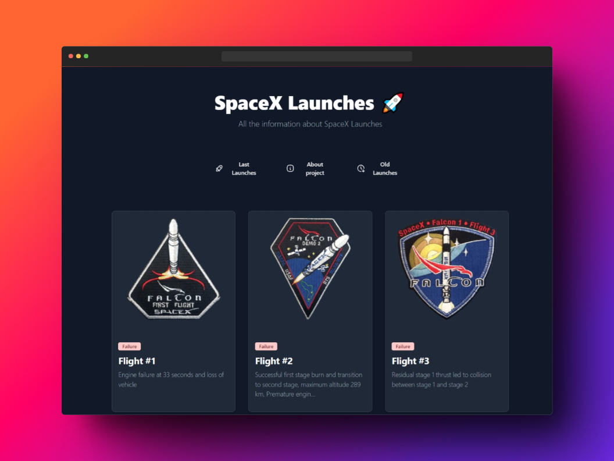

# 01-Astro-SpaceX


## Preview


## Description

The `astro-spacex` project is a web application built using the **Astro framework**, a hybrid static site generator and runtime. It incorporates seamless view transitions to enhance user experience.

### Key Features:

1. Astro hybrid
1. ViewTransitions

## Table of Contents

- [Description](#description)
  - [key features](#key-features)
  - [how to use](#how-to-use)
- [Technologies](#technologies)
- [Project Structure](#project-structure)
- [Commands](#commands)


### how to use:
```bash
# Install dependencies
npm install

# Start the server with sqlite: 
npm run dev

# Access the API at
http://localhost:4321
```

## Technologies

- [Astro](https://astro.build/)
- [Tailwind CSS](https://tailwindcss.com/)

## Project Structure

```
01-astro-spacex/
├─ public/
│   └─ favicon.svg
├─ src/
│   ├─ components
│   ├─ layouts
│   ├─ pages
│   ├─ services
│   └─ types
│
├─ astro.config.mjs
└─ package.json

```

## Commands

All commands are run from the root of the project, from a terminal:

| Command                  | Action |
| -------------------------| ------ |
| `npm install`            | Install project dependencies |
| `npm run dev`            | Start the development server |
| `npm run build`          | Build project at `dist` |
